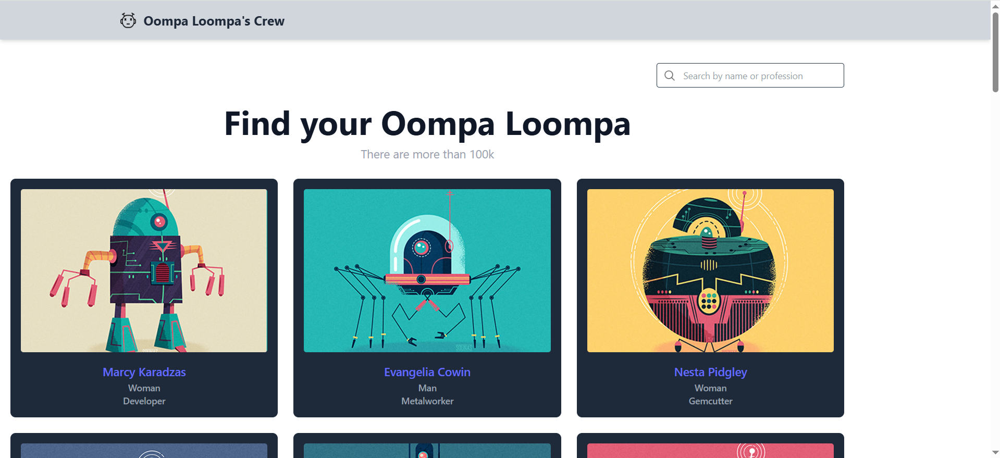
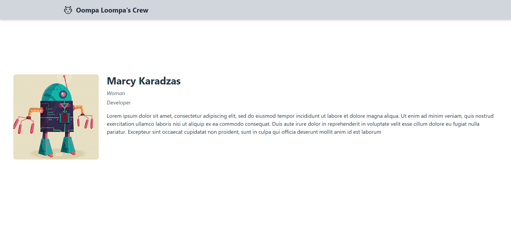

# Napptilus Oompa Loompas Test

This is a web application for managing Willy Wonka's Oompa Loompa crew at the chocolate factory, built for Napptilus Tech Labs. The tool allows the Human Resources department to browse, filter, and view detailed information about factory workers.

## 🔍 Features

* 🧍 List all Oompa Loompas (with infinite scroll)
* 🔎 Filter workers by name or profession
* 👤 View detailed information about each worker
* ⚡ Client-side routing (SPA using React Router)
* 🧠 Data caching to avoid redundant API requests within 24 hours
* 💄 Clean, responsive UI styled with Tailwind CSS

## 📸 Preview




## 🚀 Getting Started

### Prerequisites

Make sure you have:

* **Node.js** (v16 or higher recommended)
* **npm** (or **yarn**)

### Installation

1. Clone the repository:

```bash
git clone https://github.com/RaAlMer/Napptilus_Oompa_Loompas.git
cd Napptilus_Oompa_Loompas
```

2. Install dependencies:

```bash
npm install
# or
yarn install
```

3. Start the development server:

```bash
npm run dev
# or
yarn dev
```

4. Open the app:

Navigate to `http://localhost:5173` (or the port shown in your terminal).

## 🧠 Technical Overview

* **React + Vite**: for fast SPA development
* **Redux Toolkit**: for state management
* **React Router**: for client-side navigation
* **Tailwind CSS**: utility-first styling
* **LocalStorage**: to cache Oompa Loompa details for 1 day

## 📁 Project Structure

```
src/
│
├── components/         # Shared UI components
├── features/
│   ├── list/           # Oompa Loompa list logic (redux, UI)
│   └── detail/         # Detail view logic
├── App.jsx             # Main routing setup
├── main.jsx            # Entry point
└── store.js            # Redux store configuration
```

## 🧪 Future Improvements

* Improve accessibility and keyboard navigation
* Add tests (e.g. with React Testing Library)
* Deploy to a live URL (e.g., Vercel, Netlify)

## 📜 License

This project is provided for assessment purposes and is not licensed for commercial use.
